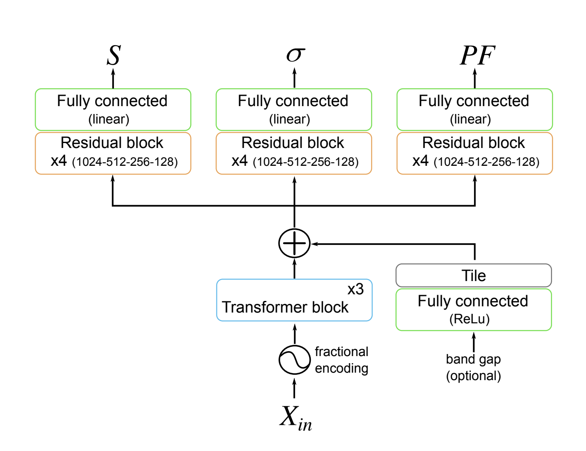

CraTENet
========

CraTENet is a multi-output deep neural network with multi-head self-attention for thermoelectric property prediction, 
based on the [CrabNet](https://github.com/anthony-wang/CrabNet) architecture. This repository contains code that can 
be used to reproduce the experiments described in the paper, including an implementation of the CraTENet model, using 
the Tensorflow and Keras frameworks. It also provides a means of obtaining the data required for the experiments.



## Table of Contents

- [Obtaining the Training Data: The Dataset Preprocessing Pipeline](#obtaining-the-training-data-the-dataset-preprocessing-pipeline)
  - [1. Downloading the Ricci et al. Database](#1-downloading-the-ricci-et-al-database)
  - [2. Extracting the _S_ and _σ_ Tensor Diagonals and Band Gap](#2-extracting-the-_s_-and-__-tensor-diagonals-and-band-gap)
  - [3. Computing the _S_, _σ_ and _PF_ Traces](#3-computing-the-_s_-__-and-_pf_-traces)
  - [4. Disambiguating Duplicate Compositions](#4-disambiguating-duplicate-compositions)
  - [5. Creating the Training Datasets](#5-creating-the-training-datasets)
- [Training the Models](#training-the-models)

## Obtaining the Training Data: The Dataset Preprocessing Pipeline

This project utilizes data from the Ricci et al. electronic transport database, which is transformed into a format that 
the CraTENet snd Random Forest models accept. Although files containing the training data are provided for download, and 
can be immediately used with the models, the entire dataset preprocessing pipeline is described here for the sake of 
transparency and reproducibility.


### 1. Downloading the Ricci et al. Database

The full contents of the original Ricci et al. database can be downloaded from 
[https://doi.org/10.5061/dryad.gn001](https://doi.org/10.5061/dryad.gn001). At the time of this writing, the dataset on
the [Dryad](https://datadryad.org/stash) website (which hosts the data) is organized into a number of different files.
For the purposes of this project, we're only interested in the files `etransport_data_1.tar` and 
`etransport_data_2.tar`. These files must be downloaded, and their contents extracted. The contents of these archives 
are compressed .json files, one for each compound (identified by their Materials Project ID). The .tar archives contain 
thousands of compressed .json files, thus, it is perhaps best to extract a .tar file's contents into its own directory, 
for ease of use.

_NOTE: It is not strictly required that the Ricci et al. database data be downloaded. This can be skipped. This 
information is provided for the sake of full reproducibility, should one wish to derive the training dataset from the 
original database._ 


### 2. Extracting the _S_ and _σ_ Tensor Diagonals and Band Gap

Assuming that the Ricci et al. electronic transport database files have been downloaded and exist in two directories, 
`etransport_data_1/` and `etransport_data_2/`, the following script can be used to extract the _S_ and _σ_ 
tensor diagonals (from which the target values will ultimately be derived):
```
python bin/extract_data_xyz.py \
--dir ./etransport_data_1 ./etransport_data_2 \
--out ricci_data_xyz.csv
```
The same can be done to extract the band gaps associated with each compound:
```
python bin/extract_data_gap.py \
--dir ./etransport_data_1 ./etransport_data_2 \
--out ricci_data_gap.csv
```

Alternatively, previously extracted _S_ and _σ_ tensor diagonals can be downloaded directly:
```
python bin/fetch_data.py xyz
```
The `xyz` argument specifies that the tensor diagonals data should be downloaded. To download the previously extracted 
band gap data, use the `gap` argument instead:
```
python bin/fetch_data.py gap
```

_NOTE: It is not strictly required that these extracted datasets be obtained. This can be skipped. This information is 
provided for the sake of full reproducibility, should one wish to derive the training data from the original database._ 


### 3. Computing the _S_, _σ_ and _PF_ Traces

Once the tensor diagonals have been extracted, the traces of the _S_ and _σ_ tensors, and the power factor 
(_PF_) trace, must be computed. These datasets can be created using the `ricci_data_xyz.csv` file.

For example, to create the Seebeck traces:
```
$ python bin/compute_traces.py seebeck \
--data ricci_data_xyz.csv.gz \
--out seebeck_mpid_traces.csv.gz
```
Similarly, the `cond` argument can be used (in place of the `seebeck` argument) to compute the electronic 
conductivity traces, and the `pf` argument can be used to compute the power factor traces.

Alternatively previously computed traces can be downloaded directly:
```
$ python bin/fetch_data.py seebeck_mpid_traces
```
The `cond_mpid_traces` argument can be used (in place of the `seebeck_mpid_traces` argument) to download previously 
computed electronic conductivity traces, and the `pf_mpid_traces` argument can be used to download previously computed 
power factor traces. 

_NOTE: It is not strictly required that these trace datasets be obtained. This can be skipped. This information is 
provided for the sake of full reproducibility, should one wish to derive the training data from the original database._


### 4. Disambiguating Duplicate Compositions

The files produced by `compute_traces.py` contain a mapping from Materials Project ID to traces. However, we are 
interested in compositions. Since there are multiple Materials Project IDs with the same composition in the Ricci et al.
database, we must somehow disambiguate these duplicates. We choose to use the Materials Project ID corresponding to the 
structure of the lowest energy polymorph.
```
$ python bin/deduplicate_traces.py \
--traces out/seebeck_mpid_traces.csv.gz out/seebeck_comp_traces.csv.gz \
--traces out/cond_mpid_traces.csv.gz out/cond_comp_traces.csv.gz \
--traces out/pf_mpid_traces.csv.gz out/pf_comp_traces.csv.gz \
--formulas data/ricci_formulas.csv \
--energies data/mp-2022-03-10-ricci_task_ener_per_atom.csv.gz \
--gaps data/ricci_gaps.csv out/comp_gaps.csv \
--mpids out/comp_to_mpid.csv
```
In this example, the `seebeck_comp_traces.csv.gz`, `cond_comp_traces.csv.gz`, `pf_comp_traces.csv.gz`, and 
`comp_gaps.csv` files are produced as output. These files each represent a mapping from composition to either traces or
gaps. As stated above, the compositions were chosen by selecting the structure with the lowest energy polymorph in cases
where entries corresponded to the same composition. The `comp_to_mpid.csv` file, containing a mapping from compositions
to the MP ID selected, is also produced.

_NOTE: It is not strictly required that these files be created. They can instead be downloaded. This 
information is provided for the sake of full reproducibility, should one wish to derive the training data from the 
original database._

Alternatively, previously deduplicated trace files can be downloaded...  #TODO 

```
$ python bin/fetch_data.py seebeck_comp_traces
$ python bin/fetch_data.py cond_comp_traces
$ python bin/fetch_data.py pf_comp_traces
$ python bin/fetch_data.py comp_gaps
$ python bin/fetch_data.py comp_to_mpid
```

### 5. Creating the Training Datasets

Once the traces have been computed for each of the properties, and they have been associated with deduplicated 
compositions, they must be used to create training datasets that the CraTENet and Random Forest models accept. This 
transforming the compositions into representations usable by the model, and associating the representations with the 
computed traces, and optionally, band gap. 

```
$ python bin/create_rf_datasets.py \
--seebeck out/seebeck_comp_traces.csv.gz out/rf_seebeck_dataset.pkl.gz \
--log10cond out/cond_comp_traces.csv.gz out/rf_log10cond_dataset.pkl.gz \
--log10pf out/pf_comp_traces.csv.gz out/rf_log10pf_dataset.pkl.gz \
--metadata out/comp_to_mpid.csv
```

```
$ python bin/create_rf_datasets.py \
--seebeck out/seebeck_comp_traces.csv.gz out/rf_seebeck_gap_dataset.pkl.gz \
--log10cond out/cond_comp_traces.csv.gz out/rf_log10cond_gap_dataset.pkl.gz \
--log10pf out/pf_comp_traces.csv.gz out/rf_log10pf_gap_dataset.pkl.gz \
--gaps out/comp_gaps.csv \
--metadata out/comp_to_mpid.csv
```

```
$ python bin/create_cratenet_datasets.py \
--seebeck out/seebeck_comp_traces.csv.gz out/cratenet_seebeck_dataset.pkl.gz \
--log10cond out/cond_comp_traces.csv.gz out/cratenet_log10cond_dataset.pkl.gz \
--log10pf out/pf_comp_traces.csv.gz out/cratenet_log10pf_dataset.pkl.gz \
--atom-vectors data/skipatom200_20201009_induced.csv \
--metadata out/comp_to_mpid.csv
```

```
$ python bin/create_cratenet_datasets.py \
--seebeck out/seebeck_comp_traces.csv.gz out/cratenet_seebeck_gap_dataset.pkl.gz \
--log10cond out/cond_comp_traces.csv.gz out/cratenet_log10cond_gap_dataset.pkl.gz \
--log10pf out/pf_comp_traces.csv.gz out/cratenet_log10pf_gap_dataset.pkl.gz \
--atom-vectors data/skipatom200_20201009_induced.csv \
--gaps out/comp_gaps.csv \
--metadata out/comp_to_mpid.csv
```

_NOTE: It is not strictly required that the training datasets be created. They can instead be downloaded. This 
information is provided for the sake of full reproducibility, should one wish to derive the training data from the 
original database._

Alternatively, the pre-created datasets may be downloaded...  #TODO


## Training the Models

#TODO

```
$ python bin/cross_validate_rf.py --dataset out/rf_seebeck_dataset.pkl.gz
```


***
TODO 
- rename "ricci_formulas.csv" to "ricci_compositions.csv"
- create a setup.py for local installation (we won't put this repo on pypi)
-- replace `python bin/create_rf_datasets.py` with `create_rf_datasets`, etc., once these scripts have been installed as CLI programs
-- create a getting started section (recommend that users should create a separate conda or virtual env that can be used for installing)
- create a development section
-- state that the environment can be created with either the requirements.txt or environment.yml
***